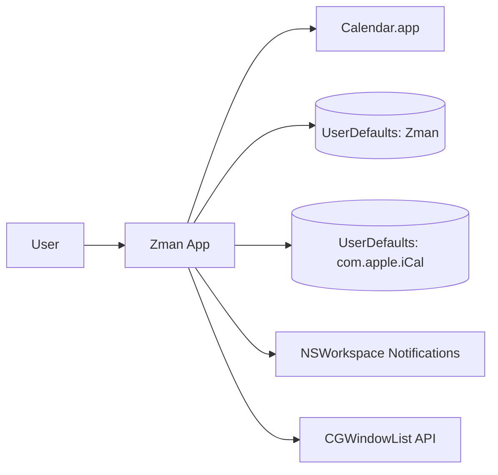
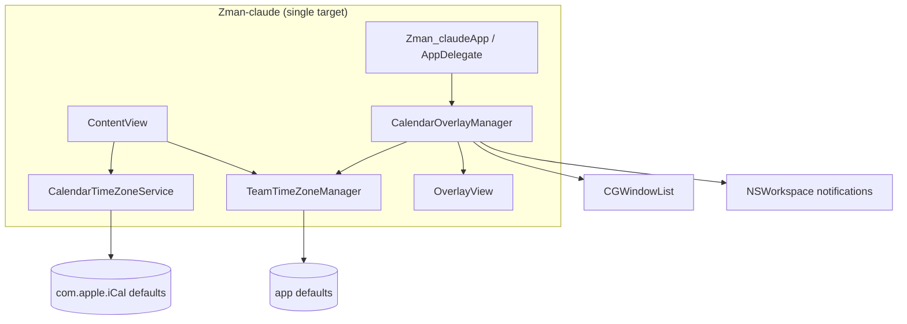
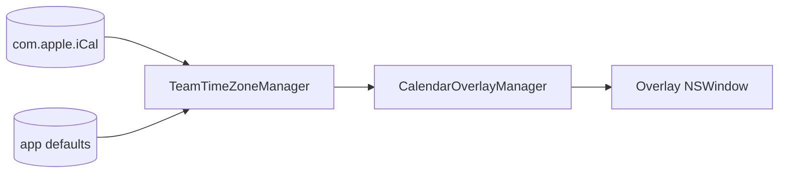
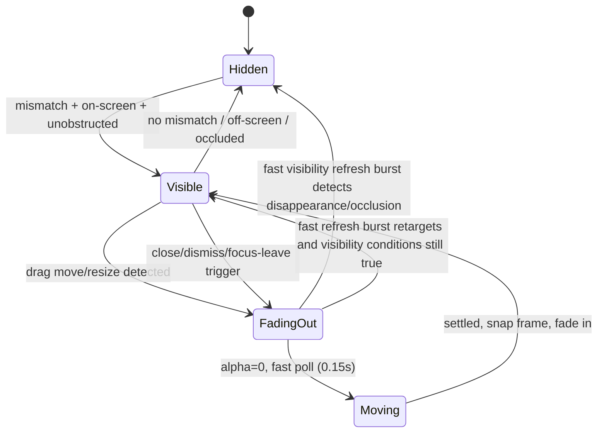

# Architecture

This document summarizes Zman's runtime architecture and behavior flows.

## C4 - System Context

## C4 - Container / Component View

## Data Flow

## Event / State Flow (Overlay Behavior)

## Runtime Notes

- Overlay visibility condition: timezone mismatch + Calendar window on current screen/Space + not occluded by non-Calendar layer-0 windows.
- Position tracking cadence:
  - idle: 1.0s (low CPU)
  - moving: 0.15s (detect stop quickly)
- Fast response paths:
  - `leftMouseDragged` in draggable area and resize border for immediate fade-out on move/resize
  - `leftMouseDown` for traffic-light close and popup outside-click dismiss
  - `keyDown` for `Cmd+W` and `Esc` dismiss
  - focus changes via `NSWorkspace.didActivateApplicationNotification` (immediate fade + single short delayed re-check)
- Fast visibility refresh burst runs at 50ms cadence for short close/dismiss transition windows to avoid waiting for the 1s idle tick.
