# Architecture

## C4 Context

Zman's external dependencies — what crosses process and system boundaries.

## C4 Component

Internal structure — how the 5 source files relate to each other and to system APIs.

## Data Flow

How timezone data moves through the system — from Calendar.app's preferences to the overlay show/hide decision.

## Event & State Flow

What triggers overlay updates, and the position tracking state machine.

### Overlay Lifecycle

A typical session — from Calendar launch through drag to Calendar quit:

### Position Tracking State Machine

Two states (idle / moving), driven by a timer that adapts its interval:

```mermaid
stateDiagram-v2
    [*] --> Idle: showOverlay()

    Idle --> Moving_pollDetected: checkPosition() detects frame change
    Idle --> Moving_mouseDetected: leftMouseDragged in toolbar area

    Moving_pollDetected --> Moving_pollDetected: frame still changing (reset settle)
    Moving_mouseDetected --> Moving_mouseDetected: frame still changing (reset settle)

    Moving_pollDetected --> Idle: settleCount reaches 2 (frame stable ~300ms)
    Moving_mouseDetected --> Idle: settleCount reaches 2 (frame stable ~300ms)

    Idle --> [*]: hideOverlay()
    Moving_pollDetected --> [*]: hideOverlay()
    Moving_mouseDetected --> [*]: hideOverlay()

    state Idle {
        [*] --> polling_1s
        polling_1s: Timer 1s — overlay visible (alpha 1)
        polling_1s: Re-checks mismatch + occlusion each tick
    }

    state Moving_pollDetected {
        [*] --> polling_150ms_a
        polling_150ms_a: Timer 150ms — overlay faded out (alpha 0)
        polling_150ms_a: Fade-out 0.15s on entry
    }

    state Moving_mouseDetected {
        [*] --> polling_150ms_b
        polling_150ms_b: Timer 150ms — overlay faded out (alpha 0)
        polling_150ms_b: Fade-out 0.1s on entry (faster — user expects instant)
    }
```

