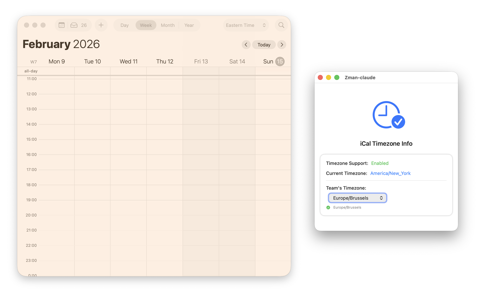

# Zman

A minimalistic macOS utility that highlights Calendar.app when the viewing timezone differs from your team's timezone.



## Features

- Detects timezone differences between Calendar.app's viewing timezone and your team's timezone
- Provides a visual overlay on the macOS Calendar app when timezones differ
- Uses fast fade-out handling for window move/resize/close/dismiss transitions to keep overlay behavior responsive

## Requirements

- macOS 26 or later
- Xcode 26.2 or later (to build from source)

## Installation

### Homebrew (recommended)

```bash
brew install plavrenko/zman/zman
```

After installation, remove the quarantine attribute (the app is not notarized):

```bash
xattr -cr "$(brew --prefix)/Caskroom/zman/*/Zman-claude.app"
```

### Build from source

```bash
git clone https://github.com/plavrenko/zman.git
cd zman
make build
open build/Release/Zman-claude.app
```

Or open `Zman-claude.xcodeproj` in Xcode and press **Cmd+R**.

## How It Works

Zman reads Calendar.app's current viewing timezone setting (the timezone you've set for viewing your calendar) and compares it with your configured team timezone. When these differ, it displays an orange overlay on Calendar.app to remind you that you're viewing your calendar in a different timezone than your team operates in.

## Configuration

The app allows you to:
- Set your team's timezone

## Privacy

Zman only reads Calendar.app's timezone preferences from your system. It does not access your calendar events or any personal data. No data is sent to external servers or stored outside of your Mac.

## Architecture

See [ARCHITECTURE.md](ARCHITECTURE.md) for diagrams — C4 context/component, data flow, and event/state flow.

## Development

Built with:
- SwiftUI
- AppKit (overlay windows, workspace monitoring)
- CoreGraphics (CGWindowList API for window tracking)
- UserDefaults (reading Calendar.app preferences)

## Author

Pavel Lavrenko
- Email: pavel@lavrenko.info

## License

Licensed under the Apache License, Version 2.0. See [LICENSE](LICENSE) for details.

Copyright © 2026 Pavel Lavrenko

## Contributing

Contributions are welcome! Please feel free to submit a Pull Request.
